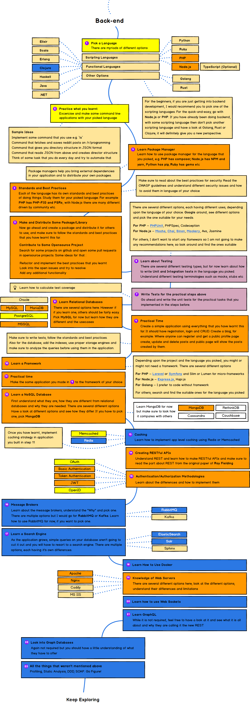

> Roadmap to becoming a web developer (backend) in 2019

## 🚀 Introduction

## 👽 Back-end Roadmap

## ☑ DOING

- [x] Testing with mocha chai and sinon in rest api built on express
- [ ] Caching with redis

## 👬 Contribution

The roadmaps are built using [Balsamiq](https://balsamiq.com/products/mockups/). Project file can be found at `/project` directory. To modify any of the roadmaps, open Balsamiq, click **Project > Import > Mockup JSON**, it will open the roadmap, update it, upload and update the images in readme and create a PR.

## License

